<h1 align="center">Redline</h1>

<p align="center"><strong>Never waste your AI subscription quota again.</strong></p>

<p align="center">
Redline watches your Codex and Claude allowances and dispatches queued agent jobs when there's
capacity to spare - with an explanation for every decision.
</p>

<p align="center">
  <a href="https://github.com/croutoncreations/redline/releases/latest"></a>
  <a href="https://github.com/croutoncreations/redline/releases/latest"></a>
  <a href="https://github.com/croutoncreations/redline/actions/workflows/ci.yml"></a>
  <a href="LICENSE"></a>
</p>

<p align="center">
  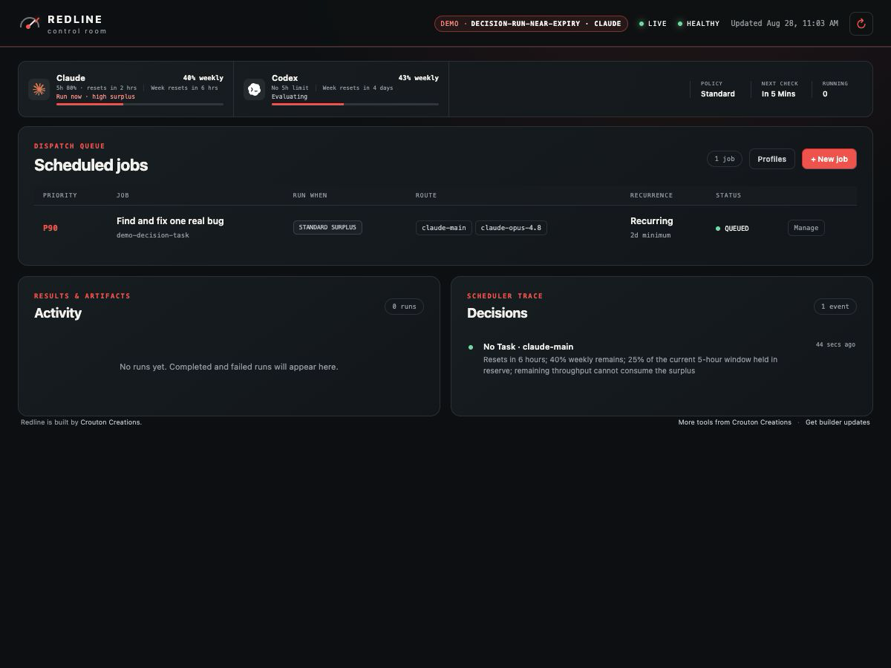
</p>

You're paying for a Codex or Claude subscription. Every five hours or every week, your quota
resets - and whatever you didn't use is gone. Redline watches those allowances and lets you queue
up the work that's always on your backlog: test gaps, refactors, dependency bumps, doc sweeps. When
you're comfortably behind on usage or running out of time before a reset, Redline fires up one of
those jobs using your coding agent of choice (Codex CLI, Claude Code, Pi, whatever you've got).

Jobs are called *tasks* in the CLI and API; the dashboard and this page say *job*.

## Why Redline

- **Every decision is explained.** Each cycle records `RUN`, `WAIT`, or fail-closed `UNKNOWN`
  with the reasoning, so you always know why a job did or did not start.
- **Safe by default.** Automatic dispatch is off until you turn it on. A configured reserve (a
  slice of your allowance Redline will never spend) is always held back for your interactive
  work, and stale telemetry means *wait*, never *run*.
- **Works with your agents.** Codex CLI, Claude Code, Pi, Hermes, or any command. Redline does
  not replace your harness; it decides when to launch it.
- **Isolated by design.** Jobs run in Git worktrees or DevX sessions, and completed runs keep
  their result, artifacts, and logs so unattended work does not disappear.
- **Local only.** A loopback service, a SQLite file, and your existing CLI logins. No cloud, no
  account, no telemetry.

## Install

### macOS app (recommended)

Requires macOS 13 or later. Universal binary, signed and notarized.

```bash
brew install --cask croutoncreations/tap/redline
```

Or [download the DMG](https://github.com/croutoncreations/redline/releases/latest), drag
**Redline** to Applications, and launch it. The menu-bar app bundles the service, dashboard, and
CLI; a four-step guide walks you through connecting an account, creating a profile, and queueing a
first job. Automatic dispatch stays off until you enable it.

→ [Getting started in five minutes](docs/getting-started.md)

### CLI and headless service (macOS, Linux, Windows)

Run Redline without the menu-bar app - on a Linux box that dispatches overnight, for example.

```bash
brew install croutoncreations/tap/redline          # macOS / Linux
go install github.com/croutoncreations/redline/cmd/redline@latest
```

Or grab a prebuilt archive from [Releases](https://github.com/croutoncreations/redline/releases/latest).
Linux and Windows builds are exercised in CI; Windows is newer and less battle-tested, so please
[report anything odd](https://github.com/croutoncreations/redline/issues).

```bash
curl -fsSLo redline.yaml https://raw.githubusercontent.com/croutoncreations/redline/main/config.example.yaml
# edit providers and policy, then:
redline serve --config redline.yaml   # dashboard at http://127.0.0.1:7436
redline status --provider codex-main
```

→ [CLI reference](docs/cli.md) · [Run as a launchd service](docs/launchd.md)

<details>
<summary><strong>Install with your coding agent</strong></summary>

Paste this into a trusted local coding agent. It installs the signed release, keeps safe defaults,
discovers your existing harnesses, and proposes a couple of editable starter jobs without enabling
automatic dispatch on its own.

```text
Help me install and configure Redline from the official Crouton Creations release:
https://github.com/croutoncreations/redline/releases/latest

Before changing anything, confirm this Mac meets the published requirements and show me the release
version and signing identity you intend to install. Download the notarized DMG and its SHA-256 file,
verify the checksum, copy Redline.app into /Applications, and launch it. Do not bypass Gatekeeper,
disable quarantine, install an unsigned build, or replace an existing configuration without asking.

In Redline, leave automatic dispatch disabled while we configure it. Check which of Codex CLI,
Claude Code, Pi, DevX, and Hermes are already installed; do not install or authenticate another
tool without asking. Reuse OpenUsage if its loopback API is healthy, otherwise let Redline use its
native collectors.

Walk me through creating one isolated execution profile for a repository I choose. Then suggest two
small, reviewable starter jobs based on that repository and my available harnesses. Show me each
editable prompt, provider, model, dispatch tier, recurrence, workspace behavior, and any command it
could execute. Ask before saving jobs and again before enabling automatic dispatch. Finish by
showing current allowance status, why the scheduler is waiting or running, where Redline stores its
configuration/database/logs, and how to pause all providers.
```

See [Agent-assisted install](docs/agent-install.md) for what the agent must not do.

</details>

## How it works

```text
  Monitor            Decide                 Dispatch              Review
  ───────            ──────                 ────────              ──────
  5-hour + weekly    policy + pace gap  →   next eligible job  →  result, artifacts,
  allowance per      RUN / WAIT / UNKNOWN   in an isolated        logs, lifecycle
  account            (explained)            workspace             events
```

1. **Monitor.** Redline reads the same 5-hour and weekly windows your CLIs see, reusing a local
   [OpenUsage](https://www.openusage.ai/) API when one is running or collecting natively
   when it is not.
2. **Decide.** A policy compares remaining allowance to remaining time. If you have more allowance
   left than an even burn pace would predict (the *pace gap*) by more than the policy's trigger,
   and the reserve is still intact, the provider is eligible. When a window is about to reset with
   allowance unspent (*near expiry*), Redline can release the reserve too rather than let it lapse.
3. **Dispatch.** Jobs unlock by tier (*behind pace* → *well behind* → *capacity likely to expire*),
   then by priority. Redline claims the job, prepares an isolated worktree or DevX session, and
   launches the *harness* - the coding-agent CLI the job's execution profile names. One job at a
   time unless you say otherwise.
4. **Review.** Completed runs keep a concise result, delivery artifacts (such as a draft PR link),
   bounded output, and a lifecycle timeline - in the dashboard, the menu bar, the CLI, or over MCP.

<table>
  <tr>
    <td width="50%" align="center"><strong>Claude - WAIT</strong></td>
    <td width="50%" align="center"><strong>Claude - RUN (near expiry)</strong></td>
  </tr>
  <tr>
    <td>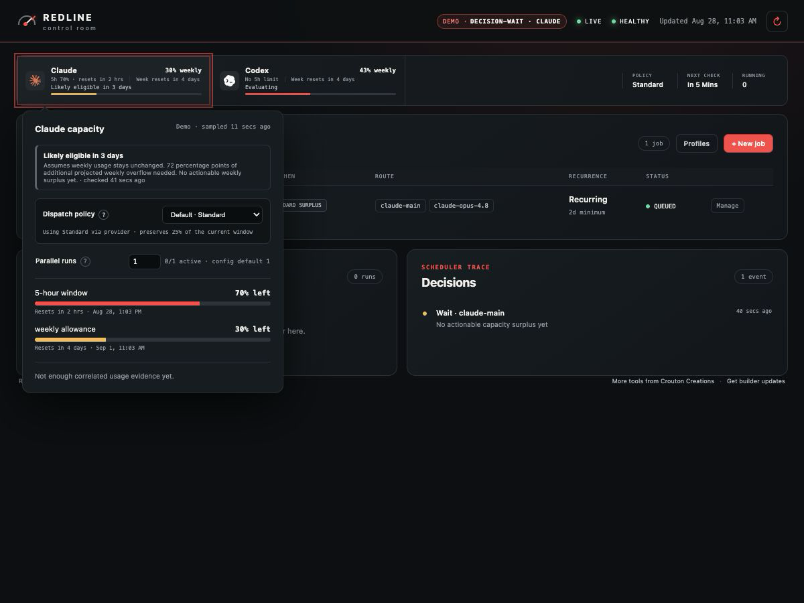</td>
    <td>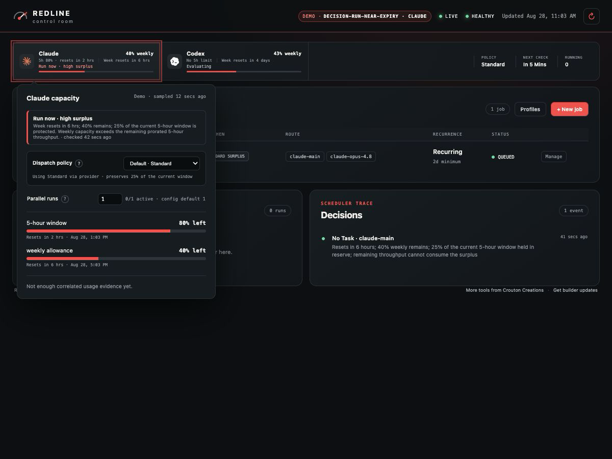</td>
  </tr>
</table>

<details>
<summary>More decision examples (Codex and Claude: WAIT, RUN, near expiry, UNKNOWN)</summary>

| Codex WAIT | Codex RUN |
|---|---|
| 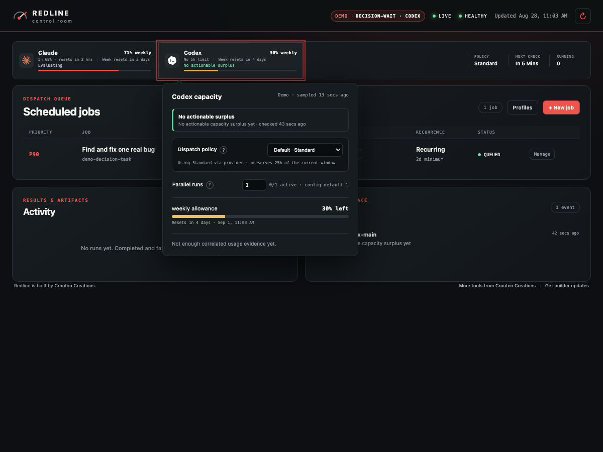 | 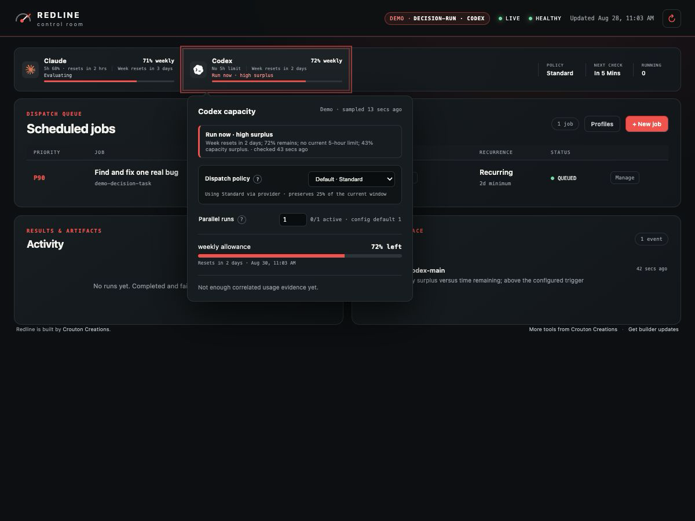 |

| Codex near expiry | Codex UNKNOWN |
|---|---|
| 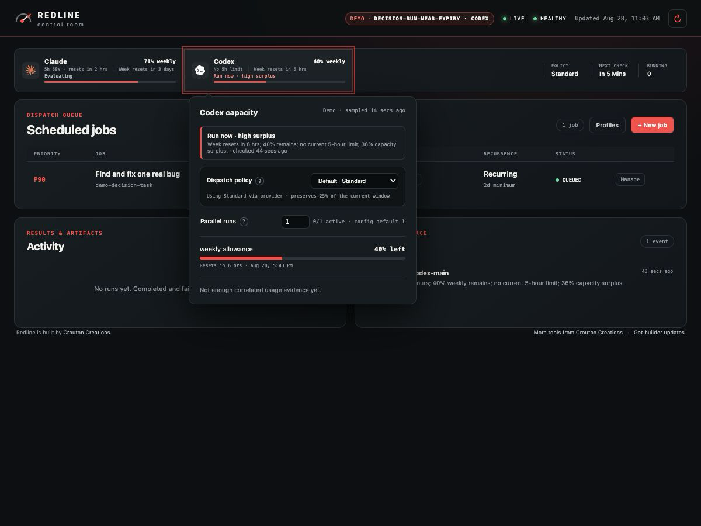 | 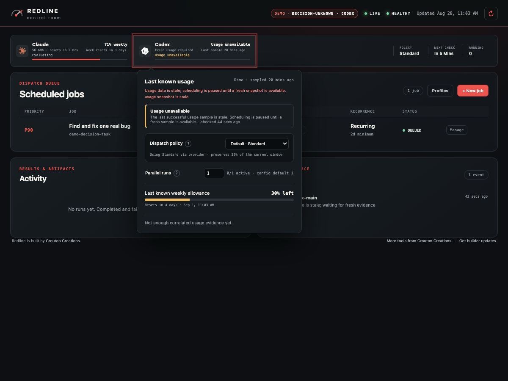 |

| Claude RUN | Claude UNKNOWN |
|---|---|
| 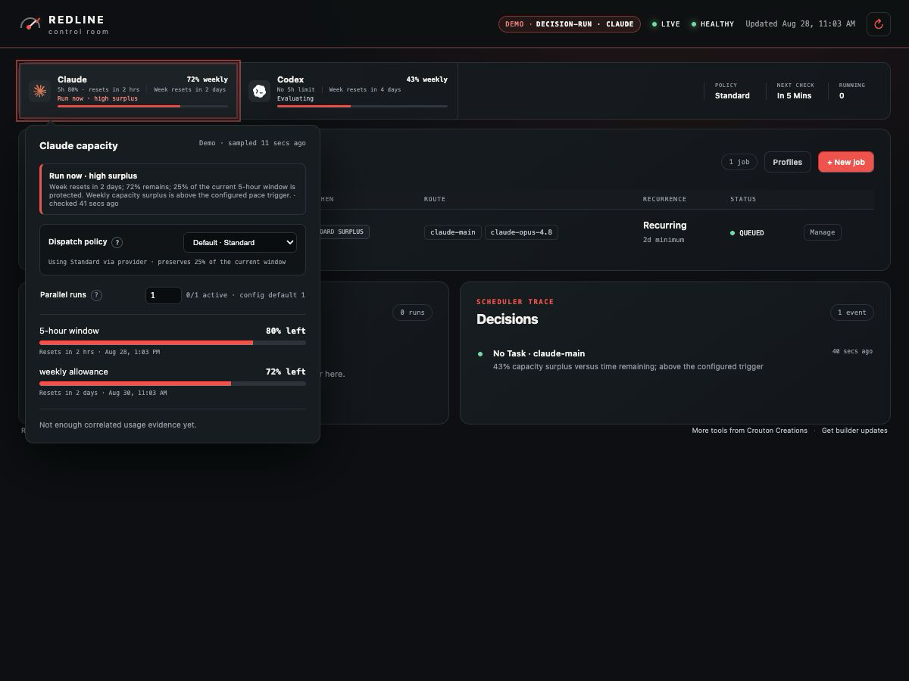 | 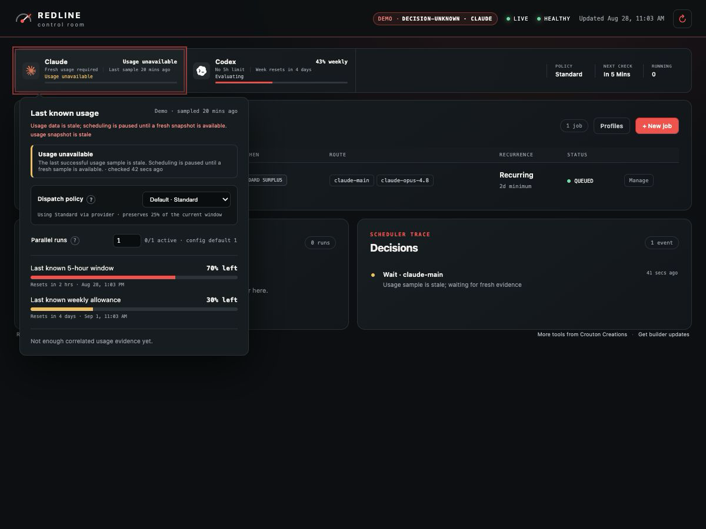 |

</details>

→ [Scheduling and the allowance model](docs/scheduling.md) explains policies, tiers, calibration,
and the token-capacity estimates in depth.

## Give your agent access

Redline ships an MCP server so Codex, Claude Code, or Pi can check allowance, inspect the queue,
add jobs, and ask *why is the scheduler waiting?* without leaving the conversation.

```bash
# Claude Code
claude mcp add --scope user redline -- redline mcp

# Codex CLI
codex mcp add redline -- redline mcp
```

Use `/Applications/Redline.app/Contents/Resources/bin/redline` if the CLI is not on your `PATH`.
Read-only tools are the default; the single dispatch tool is annotated as mutating so hosts can
gate it.

→ [MCP and agent guide](docs/mcp.md) - tool reference, Pi bridge setup, and a suggested agent
instruction.

## More screenshots

<details>
<summary>Menu bar, active work, completed runs, and configuration</summary>

<table>
  <tr>
    <td width="35%" align="center"><strong>Native quick panel</strong></td>
    <td width="65%" align="center"><strong>Active work</strong></td>
  </tr>
  <tr>
    <td align="center">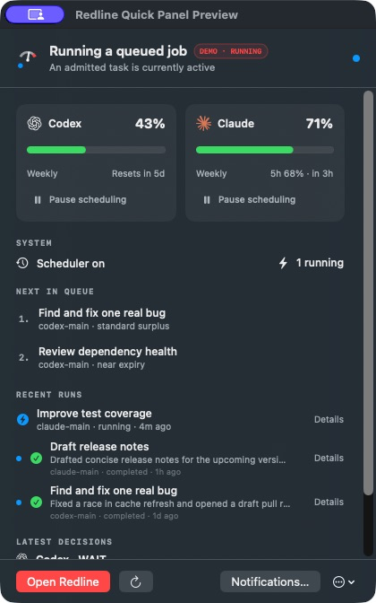</td>
    <td>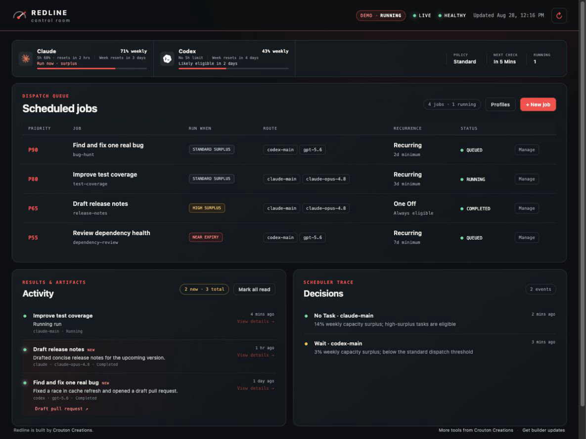</td>
  </tr>
</table>

<p align="center">
  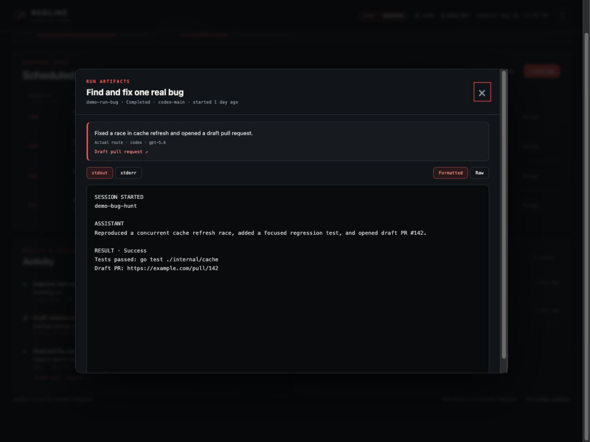
</p>

<table>
  <tr>
    <td width="50%" align="center"><strong>Job configuration</strong></td>
    <td width="50%" align="center"><strong>Execution profile</strong></td>
  </tr>
  <tr>
    <td>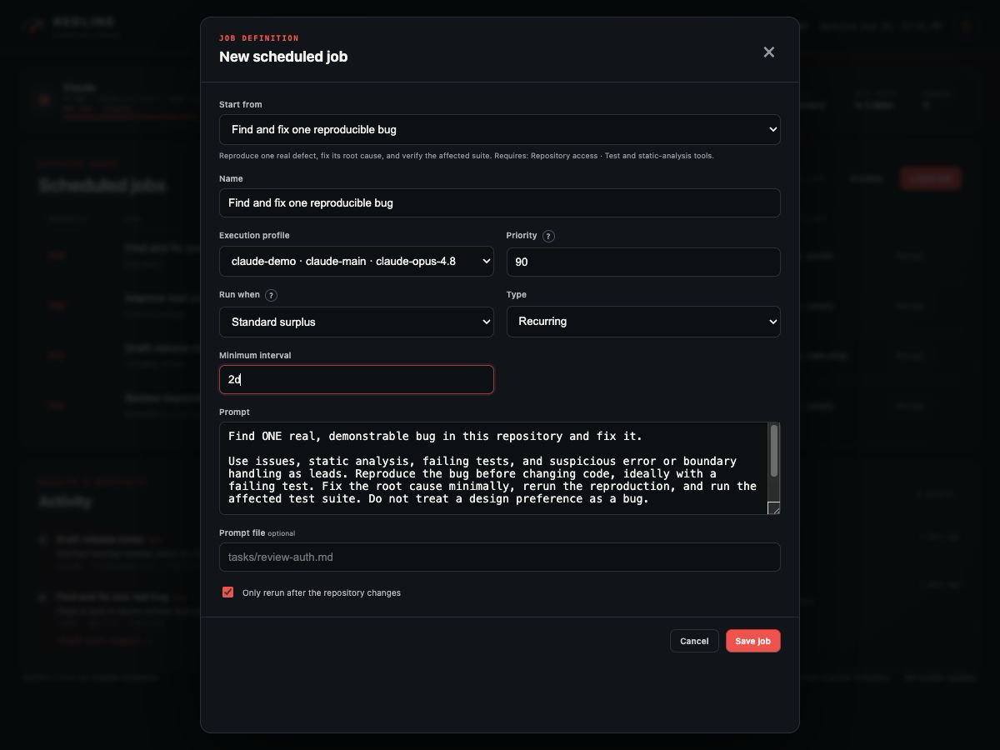</td>
    <td>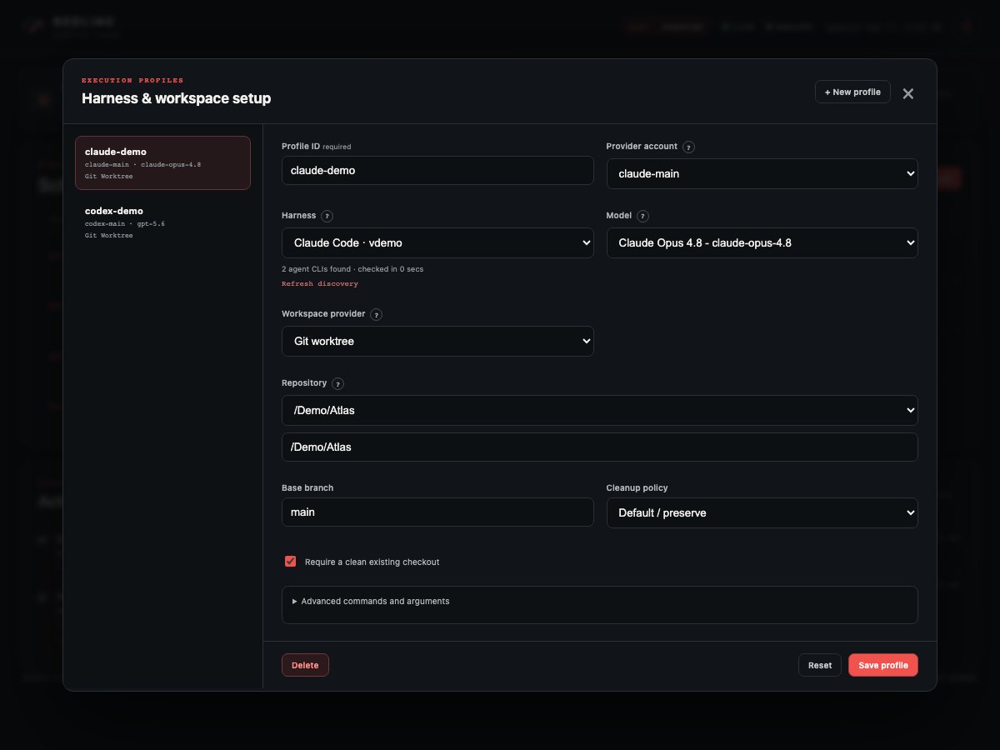</td>
  </tr>
</table>

All screenshots come from Redline's isolated synthetic demo mode and contain no personal
repositories, paths, credentials, or live allowance data.

</details>

## Documentation

| Using Redline | Reference |
|---|---|
| [Getting started](docs/getting-started.md) | [CLI](docs/cli.md) |
| [Execution profiles and tasks](docs/profiles-and-tasks.md) | [HTTP API](docs/api.md) |
| [Scheduling and the allowance model](docs/scheduling.md) | [Architecture](docs/architecture.md) |
| [Runs, logs, and notifications](docs/runs-and-notifications.md) | [Hermes integration](docs/hermes.md) |
| [MCP and agent access](docs/mcp.md) | [Native macOS app](docs/native-macos.md) |
| [Mobile dashboard](docs/mobile.md) · [launchd](docs/launchd.md) | [Outcome metrics](docs/launch-metrics.md) |
| [Troubleshooting](docs/troubleshooting.md) | [Changelog](CHANGELOG.md) · [Releasing](docs/releasing.md) |

## Contributing

Bug reports and pull requests are welcome. See [CONTRIBUTING.md](CONTRIBUTING.md) for building
from source, running the Go, Playwright, and Swift test suites, and packaging the macOS app.

## License

Apache License 2.0 - see [LICENSE](LICENSE).

---

<p align="center">
<sub>Built by <a href="https://www.croutoncreations.com/?utm_source=redline&utm_medium=github&utm_campaign=redline">Crouton Creations</a>.
<a href="https://buttondown.com/croutoncreations?utm_source=redline&utm_medium=github&utm_campaign=redline">Get new open-source tools and builder notes</a> when they ship.</sub>
</p>
